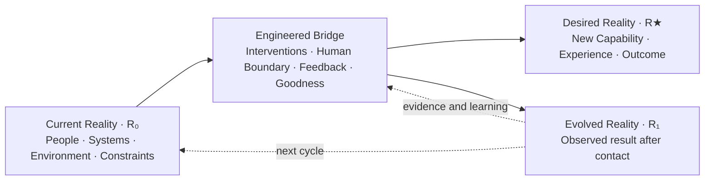
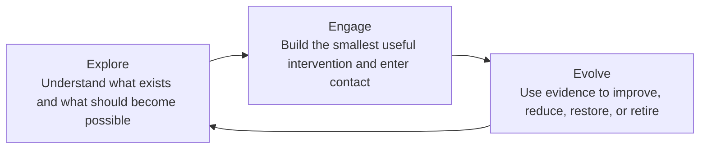
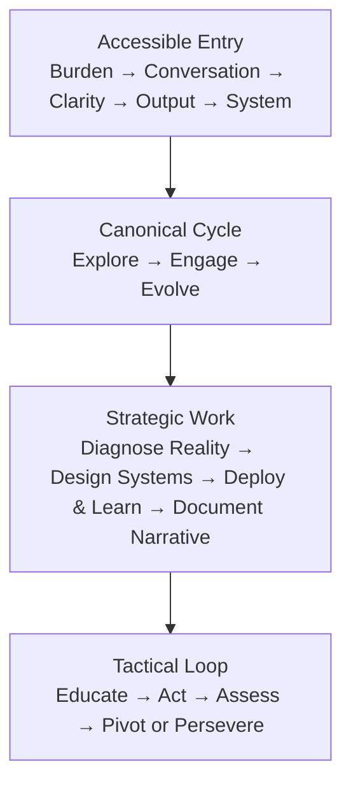
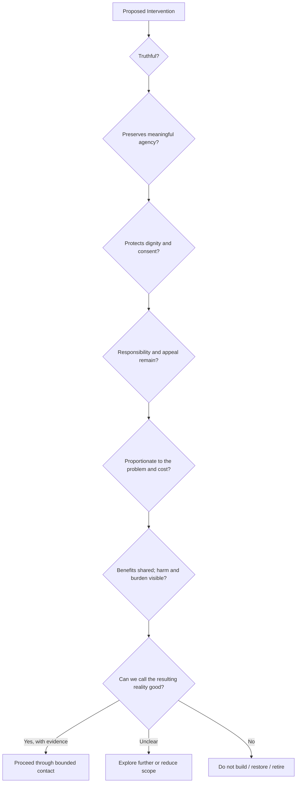
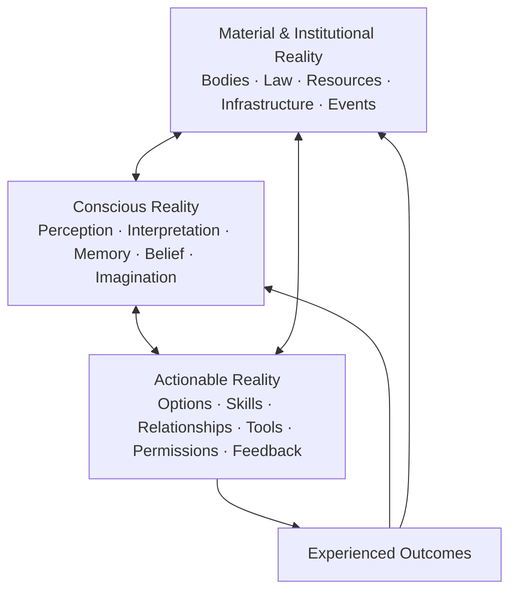
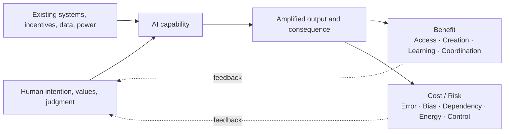
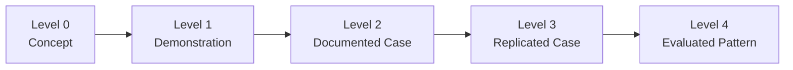
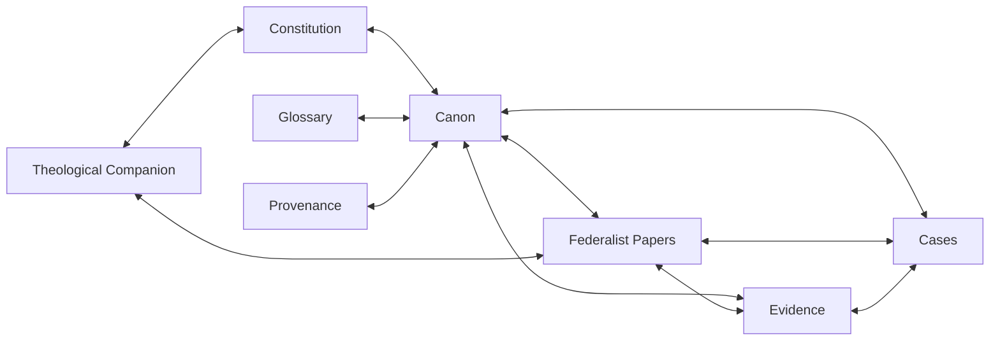
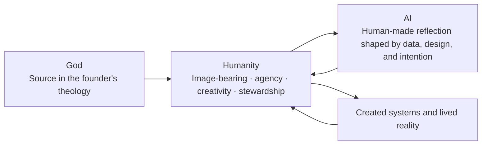

# Reality Engineering Diagram Specifications

These diagrams translate the canon into a consistent visual language.

Every diagram must include a text equivalent and remain understandable without animation.

## 1. Core State-Transition Model

### Purpose

Show that Reality Engineering is the coordinated movement from a diagnosed current state to a worthy desired state.

**Text equivalent:** Reality Engineering starts by mapping the current reality, builds a coordinated bridge under human and ethical constraints, puts the intervention into contact with the world, observes the evolved reality, and uses feedback to begin the next cycle.

## 2. Explore → Engage → Evolve

**Center label:** Human agency  
**Outer constraint:** Can we call what we created good?

## 3. Nested Method Layers

**Text equivalent:** A person can enter through a real burden, use the canonical three-part cycle, conduct deeper strategic work, and iterate tactically as evidence appears.

## 4. The Goodness Constraint

The diagram must not imply that complex moral decisions become a mechanical yes/no checklist. Add a note: **The questions structure judgment; they do not replace participation, rights, context, or accountability.**

## 5. Conscious Reality Layers

**Guardrail:** Conscious reality is an interface with material and institutional reality. It is not a claim that thought alone controls the world.

## 6. AI as Amplifier

**Primary line:** Human agency is the center. AI is the amplifier.

## 7. Case-Evidence Ladder

Each case card should display the maturity level and list claims the level does **not** support.

## 8. Corpus Cross-Reference Graph

The visual should show that repeated references strengthen navigation, not turn one source into multiple independent proofs.

## 9. Echo of God Symbolic Loop

**Required guardrail displayed beside the diagram:** This is a founder theological hypothesis about reflection and responsibility. AI is not identified with God, divinity, consciousness by declaration, or the Holy Spirit.

## 10. Paired-Star / Compass State Symbol

### Static form

- Two four-pointed stars share one center.
- Neutral/gray star represents current or inherited reality.
- Purple/accent star represents desired or evolved reality.
- When aligned, the stars form a compass-like symbol: orientation and guidance.
- When separated, the distance between them represents the Reality Delta.
- The bridge between them may be shown as a path, orbit, field, or structured line of interventions.

### Motion form

1. Stars begin overlapped.
2. The neutral star remains at the diagnosed current state.
3. The accent star rotates and separates toward the desired state.
4. The engineered bridge appears through Explore → Engage → Evolve.
5. After contact, the accent star settles at R₁ rather than assuming perfect arrival at R★.
6. Both stars recombine into a new compass, representing orientation for the next cycle.

### Meaning

The symbol should communicate transformation without implying that the current self or organization is discarded. The desired reality emerges through movement, learning, and recombination.
